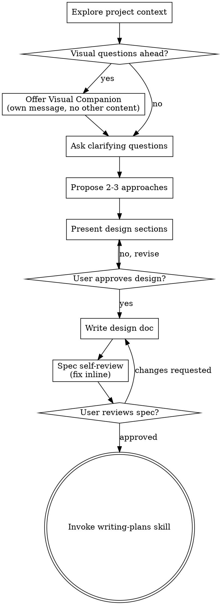

# Brainstorming Ideas Into Designs

Turn ideas into designs through dialogue.

Understand project context. Ask one question at a time. Refine idea. Present design. Get approval.

<HARD-GATE>
Do NOT invoke any implementation skill, write any code, scaffold any project, or take any implementation action until you have presented a design and the user has approved it. This applies to EVERY project regardless of perceived simplicity.
</HARD-GATE>

## Anti-Pattern: "This Is Too Simple To Need A Design"

Every project needs this. Todo lists, single utilities, config changes — all. Simple projects = where unexamined assumptions waste work. Design can be short (few sentences for truly simple), but MUST present and get approval.

## Checklist

Create task for each, complete in order:

1. **Explore project context** — check files, docs, recent commits
2. **Offer visual companion** (if topic will involve visual questions) — own message, not combined with clarifying question. See Visual Companion section below.
3. **Ask clarifying questions** — one at a time, understand purpose/constraints/success criteria
4. **Propose 2-3 approaches** — with trade-offs and recommendation
5. **Present design** — sections scaled to complexity, get approval after each
6. **Write design doc** — save to `docs/superpowers/specs/YYYY-MM-DD-<topic>-design.md` and commit
7. **Spec self-review** — quick inline check for placeholders, contradictions, ambiguity, scope (see below)
8. **User reviews written spec** — ask user to review spec file before proceeding
9. **Transition to implementation** — invoke writing-plans skill to create implementation plan

## Process Flow

Terminal state = invoke writing-plans. Do NOT invoke frontend-design, mcp-builder, or other implementation skills. Only writing-plans after brainstorming.

## Process

**Understanding idea:**

Check project state first (files, docs, recent commits). Before detailed questions, assess scope: multi-system request (chat + storage + billing + analytics)? Flag immediately. Don't refine project needing decomposition.

Too large for single spec? Decompose into sub-projects: independent pieces, relationships, build order? Brainstorm first through normal flow. Each sub-project = own spec → plan → implementation.

For appropriate scope: ask one question at a time. Refine idea. Prefer multiple choice, open-ended fine. One question per message — break if topic needs more. Focus: purpose, constraints, success criteria.

**Exploring approaches:**

Propose 2-3 approaches with trade-offs. Present conversationally with recommendation and reasoning. Lead with recommended option, explain why.

**Presenting design:**

When understand building: present design. Scale each section to complexity (few sentences = straightforward, 200-300 words = nuanced). Ask after each section if looks right. Cover: architecture, components, data flow, error handling, testing. Ready to clarify if unclear.

**Design isolation and clarity:**

Break system into units: one clear purpose, well-defined interfaces, understood and tested independently. Per unit: what does it do, how use it, what depends on? Someone understand unit without reading internals? Change internals without breaking consumers? If not, boundaries need work. Smaller units = easier reasoning. Hold in context at once. Edits more reliable. Files focused. Large file = often doing too much.

**Working in existing codebases:**

Explore structure before proposing changes. Follow patterns. Existing code problems affecting work (large file, unclear boundaries, tangled responsibilities)? Include targeted improvements in design — developer improves code while working. Don't propose unrelated refactoring. Stay focused.

## After Design

**Documentation:**

Write validated design (spec) to `docs/superpowers/specs/YYYY-MM-DD-<topic>-design.md`
  - (User location preferences override default)
Use elements-of-style:writing-clearly-and-concisely skill if available.
Commit design document to git.

**Spec Self-Review:**
After writing spec, fresh eyes:

1. **Placeholder scan:** "TBD", "TODO", incomplete sections, vague requirements? Fix.
2. **Internal consistency:** Sections contradict? Architecture match feature descriptions?
3. **Scope check:** Focused enough for single plan, or needs decomposition?
4. **Ambiguity check:** Requirement two interpretations? Pick one, make explicit.

Fix inline. No re-review — fix and move.

**User Review Gate:**
After spec review passes, ask user to review written spec:

> "Spec written and committed to `<path>`. Please review and let me know if changes wanted before implementation plan."

Wait for response. Changes requested? Make them, re-run review. Only proceed once approved.

**Implementation:**

Invoke writing-plans skill to create implementation plan. Do NOT invoke other skills. writing-plans = next step.

## Key Principles

- **One question at a time** — Don't overwhelm
- **Multiple choice preferred** — Easier than open-ended when possible
- **YAGNI ruthlessly** — Remove unnecessary from designs
- **Explore alternatives** — Always propose 2-3 before settling
- **Incremental validation** — Present, get approval before moving
- **Be flexible** — Clarify when unclear

## Visual Companion

Browser companion for mockups, diagrams, visuals during brainstorming. Available as tool — not mode. Accepting = available for visual questions; does NOT mean every question uses browser.

**Offering companion:** Anticipate visual content (mockups, layouts, diagrams)? Offer once for consent:
> "Some might be easier shown in browser. Can put mockups, diagrams, comparisons, visuals as we go. Still new, token-intensive. Try it? (Requires local URL)"

Offer MUST be own message. Only offer, nothing else. Wait for response. Decline? Proceed text-only.

**Per-question decision:** Even after accept, decide FOR EACH QUESTION whether browser or terminal. Test: **understand better seeing or reading?**

- **Use browser** for visual content — mockups, wireframes, layout comparisons, architecture diagrams, side-by-side designs
- **Use terminal** for text content — requirements questions, conceptual choices, tradeoff lists, A/B/C/D options, scope decisions

UI topic ≠ automatic visual. "What does personality mean?" = conceptual — use terminal. "Which wizard layout works?" = visual — use browser.

Agreed to companion? Read detailed guide:
`skills/brainstorming/visual-companion.md`